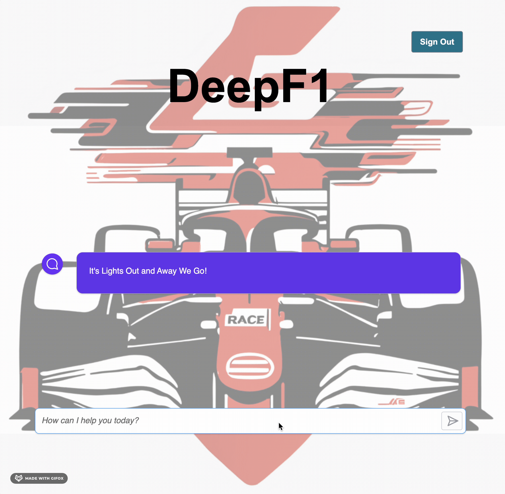
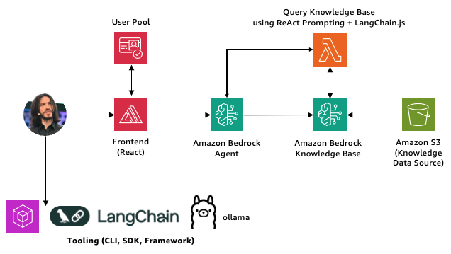

<!-- prettier-ignore -->
<div align="center">


# GenAI, from your Local machine to AWS with LangChain.js OR LlamaIndex.TS

[](https://nodejs.org/en/download/package-manager)
[](https://www.typescriptlang.org)
[](https://ollama.com/library/llama3.2)
[](LICENSE)

:star: If you like this sample, Star it on GitHub — Feedback is a Gift!

[Overview](#overview) • [Get started](#get-started) • [Resources](#resources) • [Troubleshooting](#troubleshooting)



</div>

This sample shows how to build a Serverless GenAI chat application with Retrieval-Augmented Generation (RAG) and Agents using [LangChain.js](https://js.langchain.com/) OR [LlamaIndex.TS](https://ts.llamaindex.ai/) and AWS. The application is hosted on [AWS Amplify](https://aws.amazon.com/amplify/) and leverage [Amazon Bedrock](https://aws.amazon.com/fr/bedrock/) features like Knowledge Base and Agents, with [Amazon OpenSearch Serverless](https://aws.amazon.com/opensearch-service/features/serverless/) as the vector database.
Feel free to use it as a starting point to experiment advanced GenAI features within your own application.

> [!TIP]
> You can test this application locally without any cost using [Ollama](https://ollama.com/). Follow the instructions in the [Use your Local machine](#use-your-local-machine) section to get started.

## Overview

Building AI applications can be complex and time-consuming, but using LangChain.js OR LlamaIndex.TS and AWS Services allows to greatly simplify the process. This application is a chatbot that uses Formula 1 public datasets to generate responses to user queries.

We use a fictitious company called _DeepF1_, and the experience aims to allow race engineers to get insights about drivers performance metrics and Formula 1 Championship (2022, 2023, 2024).

<div align="center">
  
</div>

This application is made from multiple components:

- A web app made of a user authentication + chat web component built with [Vite](https://vitejs.dev/guide/) and hosted on [AWS Amplify](https://docs.amplify.aws/react/start/quickstart/). The code is located in the `webapp` folder.

- A backend using Amazon Bedrock features ([Knowledge Base](https://docs.aws.amazon.com/bedrock/latest/userguide/knowledge-base.html), [Agent](https://docs.aws.amazon.com/bedrock/latest/userguide/agents.html)) to ingest documents with [AWS Lambda](https://docs.aws.amazon.com/lambda/latest/dg/getting-started.html) using [LangChain.js](https://js.langchain.com/) OR [LlamaIndex.TS](https://ts.llamaindex.ai/) to query _DeepF1_ knowledge base and generate responses to the race engineers chat queries. The code is located in the `infra` folder.
- A database to store the text extracted from the documents and the vectors generated by Amazon Bedrock Knowledge Base, using [Amazon OpenSearch Serverless](https://docs.aws.amazon.com/opensearch-service/latest/developerguide/serverless-getting-started.html). The code is located in the `infra` folder.
- An Object storage to store the source documents, using [Amazon S3](https://aws.amazon.com/s3/). The code is located in the `infra` folder.

## Features

- **Serverless Architecture**: Utilizes AWS Lambda and AWS Amplify for a fully Serverless deployment.
- **Retrieval-Augmented Generation (RAG) + Agentic**: Combines the power of Amazon Bedrock and LangChain.js OR LlamaIndex.TS to provide relevant and accurate responses.
- **Scalable and Cost-Effective**: Leverages AWS Serverless offerings to provide a scalable and cost-effective solution.
- **Local Development**: Supports local development using Ollama for testing without any Cloud costs.

## Get started

There are multiple ways to get started with this project. You can [experiment using your Local machine](#use-your-local-machine) or you can [deploy the sample to AWS](#deploy-the-sample-to-aws)

## Prerequisites

You need to install the following tools to use that sample:

- [Node.js LTS](https://nodejs.org/en/download/package-manager)
- [Docker Engine](https://docs.docker.com/engine/install/).
- [AWS CLI](https://docs.aws.amazon.com/cli/latest/userguide/cli-chap-getting-started.html)
- [AWS CDK](https://docs.aws.amazon.com/cdk/v2/guide/getting_started.html)
- [AWS Amplify CLI](https://github.com/aws-amplify/amplify-cli)

> [!IMPORTANT]
> AWS region currently supported by this sample is `us-east-1` (N. Virginia).

### Use your Local machine

In addition to the [Prerequisites](#prerequisites), you need to install the following tools to work on your local machine:

- [Ollama](https://ollama.com)

If you have a machine with enough resources, you can experiment locally without using any Cloud resources. To do that, you first have to install Ollama and then run the following commands to download models on your machine:

```bash
ollama pull llama3.2
ollama pull nomic-embed-text
```

> [!NOTE]
> The `llama3.2` model download few gigabytes of data, so it can take some time depending on your internet connection.

Then, you have to get the project code:

1. Select the **Code** button, then the **Local** tab, and copy the URL of this repository.
2. Open a terminal and run this command to clone this repo: <code>git clone &lt;repo-url&gt;</code>

Once cloned, go to the `langchain-poc` OR `llamaindex-poc` folder depending on the framework you want to experiment and install NPM dependencies:

```bash
npm install
```

When NPM dependencies are installed, go to the `src` subfolder and execute the following command lines:

- <code>node 01_local_invoke_model.js</code>
- <code>node 02_local_rag_ollama.js</code>
- <code>node 03_local_rag_bedrock.js</code>

> [!NOTE]
> While local models usually works well enough to answer the questions, sometimes they may not be able to follow perfectly the advanced formatting instructions and follow-up questions. This is expected, and a limitation of using smaller local models.

> [!IMPORTANT]
> If you want to run <code>node 03_local_rag_bedrock.js</code>, make sure to edit the `config.js` file and to provide a **knowledgeBaseId** (see [Deploy the Backend](#deploy-the-backend) section).
> If not already done, [set up the AWS CLI](https://docs.aws.amazon.com/cli/latest/userguide/getting-started-quickstart.html) using an AWS IAM User or Role with sufficient IAM Permissions to invoke the Amazon Bedrock Foundation Model of your choice.

**If you want to run the Frontend on your Local machine**, go to the `webapp` folder and install NPM dependencies:

```bash
npm install
```

If not already done, configure the AWS Amplify CLI on your local machine:

```bash
amplify configure
```

Then, initialize your own AWS Amplify application:

```bash
amplify init
```

Here is an example of initializing the AWS Amplify application (make sure the Distribution Directory Path is set to **dist**):

- ? Enter a name for the environment dev<br />
- ? Choose your default editor: Visual Studio Code<br />
- ✔ Choose the type of app that you're building · javascript<br />
- Please tell us about your project<br />
- ? What javascript framework are you using react<br />
- ? Source Directory Path:  src<br />
- ? Distribution Directory Path: **dist**<br />
- ? Build Command:  npm run-script build<br />
- ? Start Command: npm run-script start<br />
- Using default provider  awscloudformation<br />
- ? Select the authentication method you want to use: AWS profile<br />

Add Authentication to ensure only race engineers (i.e: faked users) can access cutting-edge features of your web app:

```bash
amplify add auth
```

Here is an example of adding authentication to the AWS Amplify application:

Using service: Cognito, provided by: awscloudformation<br />
The current configured provider is Amazon Cognito.<br /> 
Do you want to use the default authentication and security configuration? Default configuration<br />
Warning: you will not be able to edit these selections.<br />
How do you want users to be able to sign in? Username<br />
Do you want to configure advanced settings? No, I am done.<br />

Once authentication added, open the [AWS IAM Roles Console](https://us-east-1.console.aws.amazon.com/iam/home#/roles), look for the `amplify-webapp-dev-[UNIQUE ID]-authRole` IAM role and attach the following policies (permissions):

- arn:aws:iam::aws:policy/`AmazonBedrockFullAccess` (only used to ease usage of this sample, **do NOT use such policy in PROD**)

Lastly, push your local AWS Amplify application to ensure its configuration can be in sync with the Cloud one:

```bash
amplify push
```
When prompted if you want to continue, enter `Y`.

Once your configuration pushed to the Cloud, you can run the Frontend on your Local machine:

```bash
npm run dev
```

The Frontend will be available on http://localhost:3000

### Deploy the sample to AWS

#### AWS prerequisites

- **AWS account**. If you're new to AWS, [create an AWS account](https://aws.amazon.com/resources/create-account/).
- **AWS account permissions**. Get sufficient AWS IAM permissions (in respect of the fine-grained permissions best practice) to deploy ALL AWS resources involved in this sample.
- **Amazon Bedrock with model access granted for the Foundation Model of your choice**. You can request access by following instructions provided within the [Amazon Bedrock User Guide](https://docs.aws.amazon.com/bedrock/latest/userguide/model-access.html).

#### Cost estimation

Pricing varies per region and usage, so it isn't possible to predict exact costs for your usage.
However, you can use the [AWS Pricing Calculator](https://calculator.aws/#/) for the resources below to get an estimate.

⚠️ To avoid unnecessary costs, remember to delete ALL AWS resources if it's no longer in use (cf. [Clean up](#clean-up) section).

#### Deploy the Backend

1. Open a terminal and navigate to the `infra` folder.
2. Install NPM dependencies:

```bash
npm install
```

3. If not already done, [set up the AWS CLI](https://docs.aws.amazon.com/cli/latest/userguide/getting-started-quickstart.html) using an AWS IAM User or Role with sufficient AWS IAM permissions to deploy the sample.

4. Execute the following script into your terminal to deploy backend resources to AWS:

```bash
./cdk-deploy-to.sh [AWS_ACCOUNT_ID] [AWS_REGION] [AWS_PROFILE_NAME](optional)
```

> [!NOTE]
> Make sure to replace `[AWS_ACCOUNT_ID] [AWS_REGION] [AWS_PROFILE_NAME](optional)` with your own AWS account Id and the AWS region targeted for your deployment.

This will provision all AWS backend resources (Amazon Bedrock, Amazon S3, AWS Lambda) and build the search index (Amazon OpenSearch Serverless) based on the files found in the `./data` subfolder.

When prompted if you want to deploy these changes, enter `y`.
The deployment process will take few minutes.

#### Deploy the Frontend

Once the Backend deployed with success, go to the the `webapp` folder within your terminal and execute the following actions:

1. Install NPM dependencies:

```bash
npm install
```

2. Open the `src/App.tsx` file and replace the `bedrock` section with the following one:<br />
```bash
bedrock: {
    region: aws_exports.aws_project_region,
    // modelId: "meta.llama3-2-3b-instruct-v1:0",
    agent: {
        agentId: "[AMAZON BEDROCK AGENT ID]",
        agentAliasId: "[AMAZON BEDROCK AGENT ALIAS ID]"
    }
},
```

> [!IMPORTANT]
> Make sure to replace `[AMAZON BEDROCK AGENT ID]` and `[AMAZON BEDROCK AGENT ALIAS ID]` with Outputs values displayed in your terminal. Here is an example of Outputs:
> > DeepF1GenAIStack.AgentAliasIdOutput = 7J3ABCDEJG<br />
> > DeepF1GenAIStack.AgentIdOutput = HGYUARPLMN<br />

3. If not already done, configure the AWS Amplify CLI on your local machine to deploy this sample Frontend:

```bash
amplify configure
```

4. Initialize your own AWS Amplify application:

```bash
amplify init
```

Here is an example of initializing the AWS Amplify application (make sure the Distribution Directory Path is set to **dist**):

- ? Enter a name for the environment dev<br />
- ? Choose your default editor: Visual Studio Code<br />
- ✔ Choose the type of app that you're building · javascript<br />
- Please tell us about your project<br />
- ? What javascript framework are you using react<br />
- ? Source Directory Path:  src<br />
- ? Distribution Directory Path: **dist**<br />
- ? Build Command:  npm run-script build<br />
- ? Start Command: npm run-script start<br />
- Using default provider  awscloudformation<br />
- ? Select the authentication method you want to use: AWS profile<br />

5. Add Authentication to ensure only race engineers (i.e: faked users) can access cutting-edge features of your web app:

```bash
amplify add auth
```

Here is an example of adding authentication to the AWS Amplify application:

Using service: Cognito, provided by: awscloudformation<br />
The current configured provider is Amazon Cognito.<br /> 
Do you want to use the default authentication and security configuration? Default configuration<br />
Warning: you will not be able to edit these selections.<br />
How do you want users to be able to sign in? Username<br />
Do you want to configure advanced settings? No, I am done.<br />

Once authentication added, open the [AWS IAM Roles Console](https://us-east-1.console.aws.amazon.com/iam/home#/roles), look for the `amplify-webapp-dev-[UNIQUE ID]-authRole` IAM role and attach the following policies (permissions):

- arn:aws:iam::aws:policy/`AmazonBedrockFullAccess` (only used to ease usage of this sample, **do NOT use such policy in Production**)

6. Add Hosting to publish your web app:

```bash
amplify add hosting
```

7. Open the `src` subfolder and rename the `aws-exports.js` file with the following name: `aws-exports.ts`

8. Publish your web app (on the Internet):

```bash
amplify publish
```

When prompted if you want to publish the frontend, enter `Y`.
The deployment process will take few minutes.

Once built and artifacts published, you can use the public URL displayed in your terminal to open the _DeepF1_ Race AI Engineer web app and start chatting with the Foundation Model you specified (llama3.2 by default) which will leverage Agentic approach when required.

#### Clean up

To clean up ALL AWS resources deployed by the sample:

1. Go to the `infra` folder
2. Execute the following script into your terminal to destroy all stacks deployed by AWS CDK:

```bash
./cdk-destroy-from.sh [AWS_ACCOUNT_ID] [AWS_REGION] [AWS_PROFILE_NAME](optional)
```

When prompted if you want to delete all stacks, enter `y`.

3. Go the the `webapp` folder within your terminal:
4. Run the following command:

```bash
amplify delete
```

When prompted if you want to continue with the deletion of all the environments and local files created by Amplify CLI, enter `y`.

ALL AWS resources provisioned via the [Deploy the sample to AWS](#deploy-the-sample-to-aws) section will be deleted.

## Resources

Here are some resources to learn more about the technologies used in this sample:

- [LangChain.js documentation](https://js.langchain.com)
- [LlamaIndex.TS documentation](https://ts.llamaindex.ai/)
- [Generative AI CDK](https://github.com/awslabs/generative-ai-cdk-constructs)

You can also find [more AWS samples here](https://github.com/aws-samples).

## Troubleshooting

If you have any issue when running or deploying this sample, please [open an issue](https://github.com/ajohn-wick/deepf1-ai-engineer/issues) in this repository.

## Trademarks

This project may contain trademarks or logos for projects, products, or services. Authorized use of AWS
Trademarks or logos is subject to and must follow
[AWS Trademark Guidelines & License Terms](https://aws.amazon.com/trademark-guidelines/).
Use of AWS trademarks or logos in modified versions of this project must not cause confusion or imply AWS sponsorship.
Any use of third-party trademarks or logos are subject to those third-party's policies.
